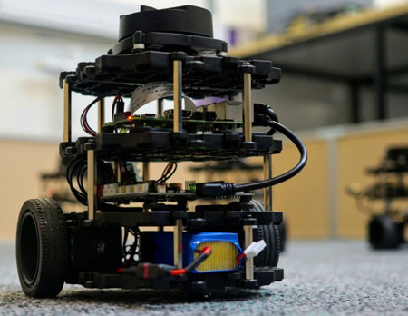
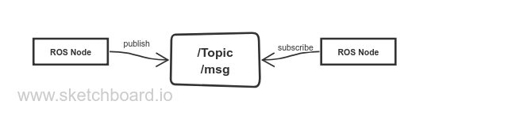
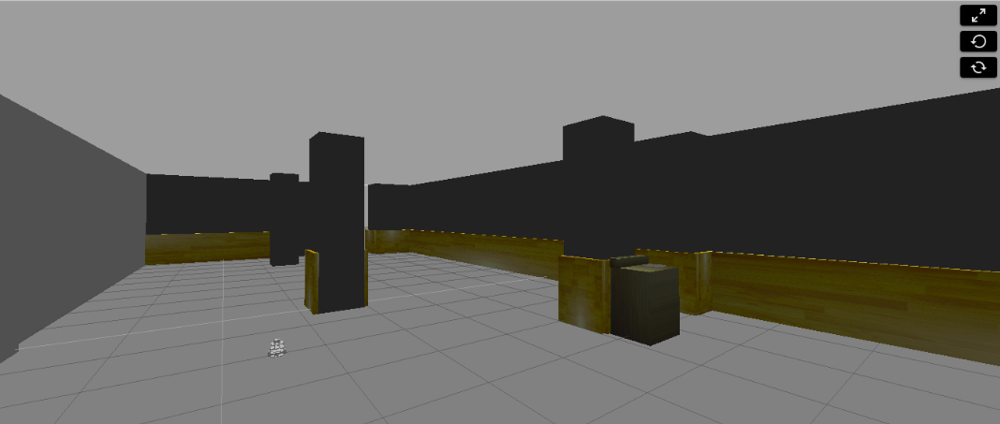
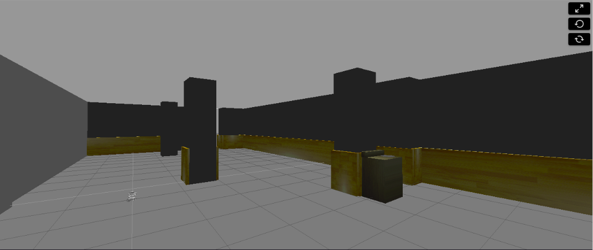
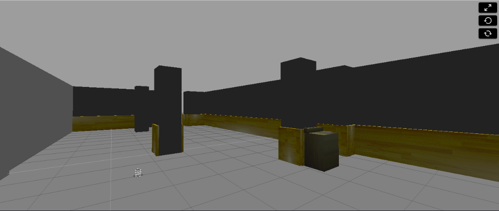
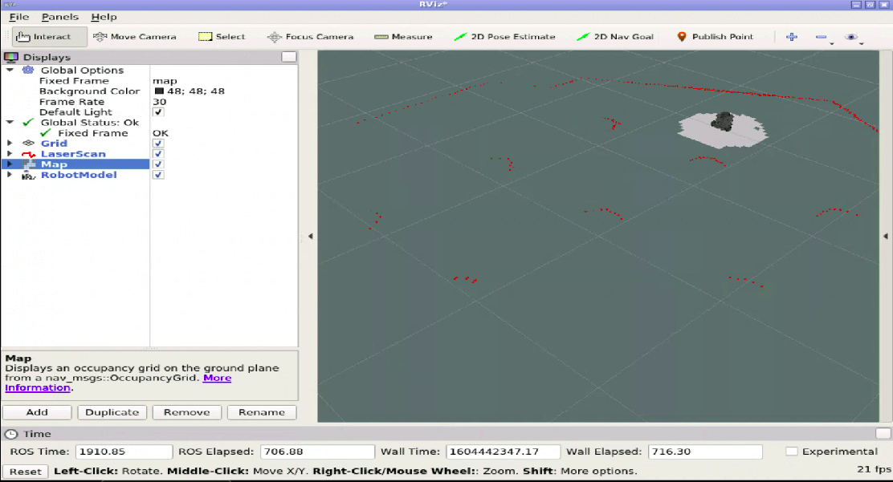
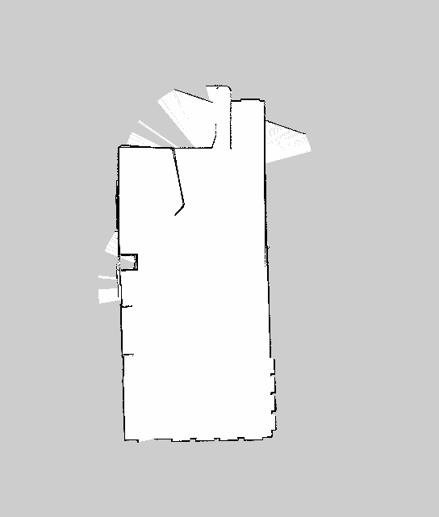
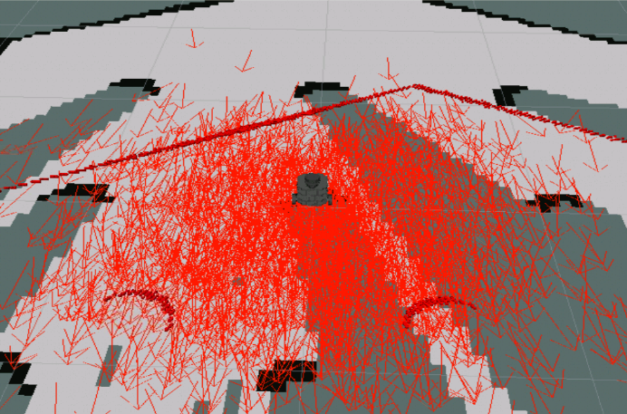

<h1 align="center"> Robotics Project </h1>  
<h3 align="center"> Planning, Developing, Learning ROS </h3>  

University Of Burgundy (VIBOT)
  

      
  

<h3 align="center">                       
Supervisors:    
 Ralph SEULIN
</h3>
<h4 align="center">                       
Students:    
 Mahmoud Badran,  Arsalan Khawaja
</h4>

  

     
     
    
  

<!-- START doctoc generated TOC please keep comment here to allow auto update -->
<!-- DON'T EDIT THIS SECTION, INSTEAD RE-RUN doctoc TO UPDATE -->
## Project Management (Technical Report)

- [Introduction](#introduction)
- [Project Tasks](#Project-Tasks)
- [Analysis OF Studied Techniques](#Analysis-OF-Studied-Techniques)
- [ROS Packages](#ROS-Packages)
- [Work Plan](#Work-Plan)
- [Conclusion](#Conclusion)

<!-- END doctoc generated TOC please keep comment here to allow auto update -->

## Introduction
Robotics Operating System (ROS), is a middleware, low level framework, to write robotic softwares. It can be cosidered as an API to make the process of developing a robotic related projects more flexible, and simplified. There will be no need for an extensive knowledge of the hardware in which it saves much effort and time in the development phase. It includes many libraries and tools which connects and control the robot manipulators, handle the comunication between multiple devices in a a working space.  
ROS is supported by many operating systems like ubunto, windows. Ubunto is the more stable operating system working with ROS. However, for the development of this project we are using the construct web plaform, which is an online robotics working environmant. The platform uses ubunto as the main operating system with ROS kinetic and uses the simulation of turtlebot 3, where we will be able to apply some of the techniques we have have learned to apply navigation and localization with map construction.  

## Project Tasks 
The project goal is to apply the learned **ROS** techniques and pakages to apply the navigation task on Turtlebot3:  
1- Create a script that moves the robot around with simple **/cmd_vel** publishing. See the range of
movement of this new robot model.  
2- Create the mapping launches, and map the whole environment. You have to finish with a clean map of
the full cafeteria. Setup the launch to be able to localize the Turtlebot3 robot.  
3- Set up the move base system so that you can publish a goal to move_base and Turtlebot3 can reach
that goal without colliding with obstacles.   
4- Create a program that allows the Turtlebot3 to navigate within the environment following a set of
waypoints.

## Analysis OF Studied Techniques

Let's explain some important concepts that have been studied and will be important in developing the project :   
- **Nodes**: One of the most important concepts in ROS. We can describe nodes as a program (python, c++) to enable ROS to make communication tasks. A node can subscribe or publish to a topic, which will be explained.   
- **Topic**: The process of transmitting data between nodes. Some nodes are responsible for publishing some data to a specific topic where other nodes (subscribers) will be able to request these data ( messages ) from the topic.  
- **Messages** : Data structure which describes the data that ROS nodes publish or recieve. the nodes communicate, send messages, receive messages through topics.  
- **Services** : another way to transmit the data between nodes. it is a synchronous operation where the robot has to stop processing while waiting for a service response.  

  

     
  

## ROS Packages

## Work Plan

---
### Task 1: Robot Control
---
Use **/cmd_vel** topic to move turtlebot3 around the environment. This topic is responsible for the **angular** and the **linear** velocity of the robot. 
we use **rostopic info /cmd_vel** to get information about the topic, after running the command we can see that this topic uses **Twist** type message. So, this topic recieves data of type Twist(angular and linear velocities ,(x,y,z)).   
- Create a node that subscribe to **/scan** topic to get distance information from objects, walls. Also it publishes tarnslation and rotation data to      **/cmd_vel** topic to rotate and move the robot.  

  

     
    
    
    
  

  

 
### Task 2: Mapping & localization   
#### <ins> *Mapping* </ins>

To start the autonomus navigation process, the robot must have a map of the environment to be able to recognize objects, walls where it will allow the robot to plann trajectories through environment.   
In order to construct a map :    

- We need to use **gmapping** package and run **slam_gmapping** node. 
    This node is implementing the gmapping **SLAM** algorithm. It creates a 2D map of the environment using the data the Robot is providing during movement like       laser data, in which it will be transformed to an Occumaoncy Grid Map (OGM) data format (**nav_msgs/OccupancyGrid.msg**) where it represents a 2-D grid map and each cell of the grid represents the occupancy ( if the cell is completely occupied or completely free).  
    Start the mapping process by executing this command:  
    <**rosrun gmapping slam_gmapping**>   
- In the mapping process, an important tool is used called **RViz**. It will help us in visulising th map creation process, it will allow us to see what the robot is covoring from the environment.     
    

    

       
    

    

- You can see in the figure above **Rviz**. In the left, we can see the displays which can be addded by us. we are interested in three displays which are:
    - **Map**: visulize the map. Topic is **/map** where it has message of type Occupancy Grid Map **OGM**, (**nav_msgs/OccupancyGrid.msg**)    
    - **LaserScreen**:  visualze what the Lazer on the robot is detecting. Topic is **/scan** 
    - **RobotModel**:  localize the Robot on the map.  
- After launnching **slam_gmapping** and **RViz**, we can start moving the robot by executing Kerbord control command:  
  (**roslaunch turtlebot_teleop keyboard_teleop.launch**).  After moving the robot around all the places needed we should see the map fully occupied in **Rvis** 
    

    

       
    

    
 
- The map can be saved using **map_server** package, it includes **map_savor** node  which will allow us to access the map data. 
    Execute this command :   
    - **rosrun map_server map_savor -f <file_name>**   
 After executing it will generate two files:   
       - **file_name.pgm:** PGM stands for Prtable Gray Map where it contains the Occupancy Grid Map(OGM) data. if we download the file and open it, it will look like this: 
      

      

           
        <em>Each cell ranges from 0 to 100 integer value where 0 means completely free and not occupied, 100 is completely occupied</em>
      

      

      
       - **file_name.yaml:** This file contains the meta data of the generated map which contains these parametrs, image,resoulution, origin, occupied_thresh, free_thresh,negate. 
       
#### <ins> *Localization* </ins>
After creating the map, the next step is to locate the robot in the environment (created map). We can define localization as the process of finding the location of the robot in respect with the environment. For now, we have the map of the environment created, and we have sensors located on the robot which will observe the environment then we do localization to estimate the coordinates and angles of where the robot is located in the environment. 

- To apply localization, we use **amcl** package. It is a localization system that implements Kullback-Leibler algorithm which uses an adaptive practicale filters to track the position of the robot in repect with the environment.  

Subscribed Topics (message type) | published Topics (message type) 
------------ | -------------
**map** (nav_msgs/OccupancyGrid) | **amcl_pose** (geometry_msgs/PoseWithCovarianceStamped)
**scan** (sensor_msgs/LaserScan) | **particlecloud** (geometry_msgs/PoseArray)
**tf** (tf/tfMessage) | **tf** (tf/tfMessage)

- **map topic:** amcl subscribe to map topic to get the map data (OGM), to used it for localization. 
- **scan topic:** To have the updated scan readings. 
- **tf:** Transform topic which is necessery to provide the relationship between different reference frames. For example, translate from the base_laser coordinate frame to base_link coordinate frame. 
- **amcl_pose:** amcl node publishes the position of the robot in the environment to the amcl_pose topic.
- **particlecloud:** amcl publishes the particle cloud of arrows created by the system to measure the uncertainty of the robot current position. see the figure below (red arrows displayed using Rviz)  
    

      

           
      

      

     

## Conclusion

## Sponsors 

Support this project by becoming a sponsor. Your logo will show up here with a link to your website. [[Become a sponsor](https://opencollective.com/git-point#sponsor)]

## Acknowledgments

Thanks to [JetBrains](https://www.jetbrains.com) for supporting us with a [free Open Source License](https://www.jetbrains.com/buy/opensource).
