<h1 align="center"> Robotics Project </h1> <br>
<h3 align="center"> Planning, Developing, Learning ROS </h3> <br>
<p align="center">
University Of Burgundy (VIBOT)
  <p align="center">
      
  </p>
</p>

<h3 align="center">                       
Supervisors: <br>  
 Ralph SEULIN
</h3>
<h4 align="center">                       
Students: <br>  
 Mahmoud Badran,  Arsalan Khawaja
</h4>
<p align="center">
  <p align = "center">
     
     
    
  </p>
</p>

[](https://shields.io/)
[](https://shields.io/)
[](http://wiki.ros.org/kinetic/Installation)
[](https://www.theconstructsim.com/)


## Technical Documentation 

- [Introduction](#introduction)
- [Project Tasks](#Project-Tasks)
- [Analysis OF Studied Techniques](#Analysis-OF-Studied-Techniques)
- [Implementation](#Implementation)
- [Conclusion](#Conclusion)
- [References](#References)

<!-- END doctoc generated TOC please keep comment here to allow auto update -->

## Introduction
Robotics Operating System (ROS), is a middleware, low level framework, to write robotic softwares. It can be considered as an API to make the process of developing a robotic related projects more flexible, and simplified. There will be no need for an extensive knowledge of the hardware in which it saves much effort and time in the development phase. It includes many libraries and tools which connects and control the robot manipulators, handle the communication between multiple devices in a a working space. <br>
ROS is supported by many operating systems like ubuntu, windows. Ubuntu is the more stable operating system working with ROS. However, for the development of this project we are using the construct web platform, which is an online robotics working environment. The platform uses ubuntu as the main operating system with ROS kinetic and uses the **Gazebo** as real world simulator with many robot model simulations like turtlebot 3. The platform will enable us to learn some of ROS basic techniques to be able to apply Robot Control, Mapping, Robot Localization, Path planning and setting up some goals to navigate through the environment.  

## Project Tasks 
The project goal is to apply the learned **ROS** techniques and packages to apply the navigation task on Turtlebot3:  
- Moving the robot around the environment using **/cmd_vel** topic. <br>
- Construct a map of the whole environment. We need to fully occupy the whole environment, then we need to localize the Robot. <br>
- Path planning, we need to publish a goal to move base navigation system in which Turtlebot3 can reach
that goal without colliding with any obstacles. <br> 
- Create waypoints that allows Turtlebot3 to navigate within the environment. 

## Analysis OF Studied Techniques

- Important concepts that have been studied and will be important in developing the project : <br><br>
   - **Nodes**: One of the most important concepts in ROS. We can describe nodes as a program (python, c++) to enable ROS to make communication tasks. A node can subscribe or publish to a topic, which will be explained. <br><br>
   - **Topic**: The process of transmitting data between nodes. Some nodes are responsible for publishing some data to a specific topic where other nodes (subscribers) will be able to request these data ( messages ) from the topic.<br><br>
   - **Messages** : Data structure which describes the data that ROS nodes publish or receive. the nodes communicate, send messages, receive messages through topics.<br><br>
   - **Services** : another way to transmit the data between nodes. it is a synchronous operation where the robot has to stop processing while waiting for a service response.<br><br>

  <p align="center">
    <p align = "center">
       
    </p>
  </p>
  
- ROS Packages & Basic Commands : <br>
   - A package in ROS is a working directory which contains all the necessary ROS files like executable python and cpp files, configuration and compilation files and launch files. 
   - The structure of the package directory:<br> 
      - **src** folder which contains all the executable files 
      - **launch** folder which contains all the launch files
      - **package.xml** file which contains other packages dependencies and url paths. In case we want to be able to call other packages from this package. 
      - **CMakeLists.txt** file which contains some cpp compilations and building commands. 
    - The main working space in ROS is called **catkin_ws**. It is a directory where all our ROS packages are installed.  
    - We can move to any package using **roscd** <br> 
     ```roscd <package_name>```
    - ROS programs(nodes) can be executed using launch files, with launch files we can run multiple nodes in one file. A launch file can be run using **roslaunch**  command: <br> 
    ```roslaunch <package_name> <launch_file>```
    - If we want to create a package in the working space **catkin_ws**, we use this command: <br>
      ``` catkin_create_pkg <package_name> <package_dependencies> ```
    - If we want to know some information about a specific node, we use this **rosnode** command: <br> 
      ``` rosnode info <node_name>``` 
    - If we want to know some information about a specific topic, we use this **rostopic** command: <br> 
      ``` rostopic info <topic_name>```  
    - If we want to know some information about a specific message, we use this **rosmsg** command: <br> 
    ``` rosmsg show info <msg_name>```  <br> 
    - An important command needed to be running before start working with any ROS project called **roscore**. It contains all the necessary files for any ROS system.
      

## Implementation

```
Task 1: Robot Control
```
As been explained in the introduction, we are going to work with a simulated Gazebo world with the  Turtlebot3 model.
- First of all, it is necessary to start and launch our turtlebot3. It is done using the **turtlebot3_bringup** package and by starting **turtlebot3_remote.launch** file. <br> 
 ```<include file="$(find turtlebot3_bringup)/launch/turtlebot3_remote.launch" />``` <br> 
- One important command we can use to know what are the topics that got published by the environment. <br> 
```rostopic list``` <br> 
By executing this command, we can see all the topics provided by the environment. One of the topics that should be provided to move the robot is **/cmd_vel**:   

- With this topic we can publish velocity information to the robot. if we want to know more information about this topic we can execute this command: <br> 
   - ```rostopic info /cmd_vel ``` <br> 
       After running the command we can see that this topic uses **Twist** type messages. So, this topic receives data of type Twist (angular and linear         velocities ,(x,y,z)). To know more information about the message we execute this command: <br> 
       ```rosmsg show geometry_msgs/Twist``` <br> 
       See the Figure below : <br> 
       <p align="center">
          <p align = "center">
             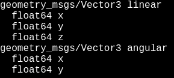
          </p>
        </p>
         
- TurtleBot3 receives the velocity information by subscribing to this topic. The topic will provide the robot translation and rotation data. 
- We can publish to this topic by running this command: 
  ```rostopic pub /cmd_vel  TAB TAB```
  And then in the terminal we can edit the values of the two vectors. 
- Otherwise, we can create a launch file to run a node responsible for publishing velocity information to the robot. see the code below: <br> 
   ```self.pubNode = rospy.Publisher('/cmd_vel', Twist, queue_size=1)``` <br> 
   ```self.msgTwistObj = Twist()``` <br> 
   ```self.msgTwistObj.linear.x = 0.2 ```<br> 
   ```self.pubNode.publish(self.msgTwistObj)``` <br> 
   Here, we create a variable called **pubNode** that is responsible for publishing Twist information to **cmd_vel** topic. And another variable called **msgTwistObj** that holds Twist message values. As you can see in the last command , we added 0.2 value to the x linear position of the robot.The last command, we used 'publish()' function to publish the new updated message values. <br> 
- Another topic we use is **/scan** topic, we use this topic to get the laser information, readings from the robot. For example, the distance between the robot and a wall in the environment. The message used is of type **LaserScan**. See the commands below:<br> 
```self.subNode = rospy.Subscriber('/scan', LaserScan, self.callback)```<br> 
```self.laserMsg = LaserScan()```<br> 
    In our node, we create another variable called **subNode** to subscribe to **/scan** topic. And another variable called **laserMsg** which holds a laser information and readings.  The **callback** parameter in the Subscriber function is a function that have the updated laser information. see command bellow:<br> 
    ```def callback(self, msg):```<br>
        ```self.laserMsg = msg```<br>   
    ```self.laserMsg.ranges```   <br> 
   So, whenever the robot moves, the variable **laserMasg** will be updated. One of the useful information we can obtain from **laserMsg** is the **ranges** parameter. we use **ranges** parameter to know the distance between the robot and an object in the environment. <br> 
   See the Figure below. It shows different frames of the robot after launching the node that is responsible for moving the robot. 

<p align="center">
  <p align = "center">
     
    
    
    
  </p>
</p>
<br><br><br>

- To see our implementation for this task, in the [src](https://github.com/MahBadran93/ROS_Project/tree/main/catkin_ws%20/src) folder of our [catkin_ws](https://github.com/MahBadran93/ROS_Project/tree/main/catkin_ws%20) working space we created a package called [Task1](https://github.com/MahBadran93/ROS_Project/tree/main/catkin_ws%20/src/Task1) and inside this package src folder we created a node called [moverobot](https://github.com/MahBadran93/ROS_Project/blob/main/catkin_ws%20/src/Task1/src/moverobot.py).


``` 
Task 2: Mapping & localization 
```
<br>
<h4 align="center"> <ins> Mapping </ins> </h4>

To start the autonomous navigation process, the robot must have a map of the environment to be able to recognize objects, walls where it will allow the robot to plan trajectories through environment. <br> 
In order to construct a map : <br> <br>


- Launch TurtleBot3 (Explained in Task1) 
- To start of the mapping process we need to use **gmapping** package that provides **slam_gmapping** node. 
    This node is implementing the gmapping **SLAM** algorithm. It creates a 2D map of the environment using the data the Robot is providing during movement like       laser data, in which it will be transformed to an occupancy Grid Map (OGM) data format (**nav_msgs/OccupancyGrid.msg**) where it represents a 2-D grid map and each cell of the grid represents the occupancy ( if the cell is completely occupied or completely free). <br>
    Start the mapping process by adding this command to the launch file: <br>
    ```   <node pkg="gmapping" type="slam_gmapping" name="turtlebot3_slam_gmapping" output="screen">``` <br><br>
    
- In the mapping process, an important tool is used called **RViz**. It will help us in visualizing th map creation process, it will allow us to see what the robot is covering from the environment. <br>   
To launch Rviz. Execute this command: ``` rosrun rviz rviz ```
    <p align="center">
    <p align = "center">
       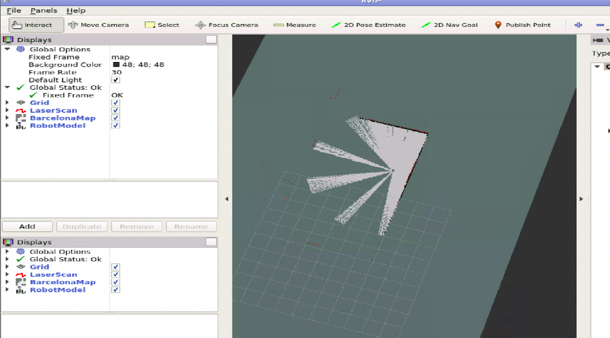
    </p>
    </p>
- You can see in the figure above **Rviz**. In the left, we can see the displays which can be addded by us. we are interested in three displays which are:
    - **Map**: visualize the map. Topic is **/map** where it has message of type Occupancy Grid Map **OGM**, ```nav_msgs/OccupancyGrid.msg ```  <br> 
    - **LaserScreen**:  visualize what the Laser on the robot is detecting. Topic is **/scan**<br>
    - **RobotModel**:  localize the Robot on the map.<br><br>
- After launching **slam_gmapping** and **RViz**, we can start moving the robot by executing Keyboard control command:<br> 
  ```roslaunch turtlebot3_teleop turtlebot3_teleop_key.launch ```.<br> After moving the robot around all the places needed we should see the map fully occupied in **Rvis**<br>
    <p align="center">
    <p align = "center">
       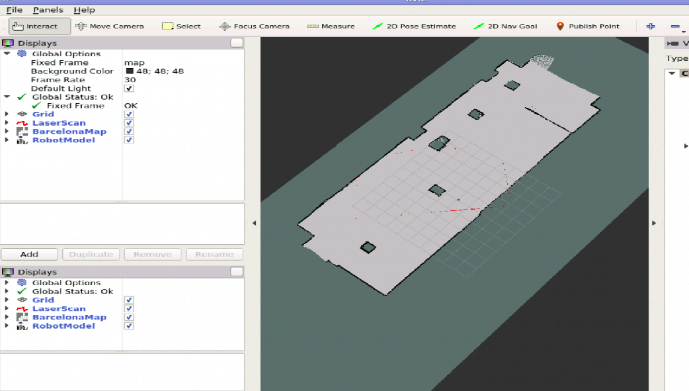
    </p>
    </p> 
- The map can be saved using **map_server** package, it includes **map_saver** node  which will allow us to access the map data. 
    Execute this command : <br> 
    - ``` rosrun map_server map_saver -f testmapbarcelonaFinal ```
 After executing it will generate two files: <br><br>
       - **testmapbarcelonaFinal.pgm:** PGM stands for Portable Gray Map where it contains the Occupancy Grid Map(OGM) data. If we download the file and open it, it will look like this: 
      <p align="center">
      <p align = "center">
         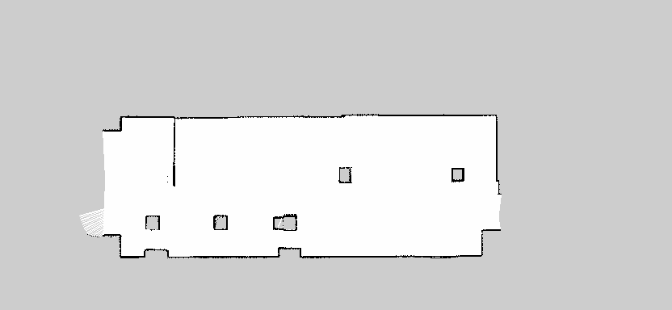 <br>
        <em>Each cell ranges from 0 to 100 integer value where 0 means completely free and not occupied, 100 is completely occupied</em>
      </p>
      </p>
      
       - **testmapbarcelonaFinal.yaml:** This file contains the meta data of the generated map which contains these parameters, image,resolution, origin, occupied_thresh, free_thresh,negate. <br>
       
- For the implementation of Task 2, we created a package called [task_navigation](https://github.com/MahBadran93/ROS_Project/tree/main/catkin_ws%20/src/task_navigation). In the [launch folder](https://github.com/MahBadran93/ROS_Project/tree/main/catkin_ws%20/src/task_navigation/launch), we created a launch file called [start_mapping](https://github.com/MahBadran93/ROS_Project/blob/main/catkin_ws%20/src/task_navigation/launch/start_mapping.launch)  that will launch the **slam_gmapping** node. <br>
       Also in this package we created [maps](https://github.com/MahBadran93/ROS_Project/tree/main/catkin_ws%20/src/task_navigation/maps) folder that will contains the map files.
       
       
 
--- 
 
<h4 align="center">  <ins> Localization </ins> </h4>

After creating the map, the next step is to locate the robot in the environment (created map). We can define localization as the process of finding the location of the robot in respect with the environment. For now, we have the map of the environment created, and we have sensors located on the robot which will observe the environment then we do localization to estimate the coordinates and angles of where the robot is located in the environment. 

- To apply localization, we use **AMCL (Adaptive Monte Carlo Localization)** package which provides **amcl** node. It is a localization system that implements Kullback-Leibler(Monte Carlo) algorithm which uses an adaptive particle filters to track the position of the robot w.r.t the environment. <bR> 
  
    **What is Monte Carlo Algorithm ?** <br>
    An algorithm which is responsible for generating many future guesses (Particles) of the robot expected movements in the environment. When the robot starts moving, the algorithm starts generating Particles and then uses the obtained sensor information (**/scan**) to create an optimized robot movement ( make all the created Particles head to the right direction). See below Table which describes the topics subscribed and published by AMCL.<br><br> 
    Subscribed Topics (message type) | published Topics (message type) 
    ------------ | -------------
    **map** (``` nav_msgs/OccupancyGrid```) | **amcl_pose** (```geometry_msgs/PoseWithCovarianceStamped```)
    **scan** (```sensor_msgs/LaserScan```) | **particlecloud** (```geometry_msgs/PoseArray```)
    **tf** (```tf/tfMessage```) | **tf** (```tf/tfMessage```)
    
     <br>
     
    - **map:** amcl subscribes to map topic to get the map data (OGM), to used it for localization. 
    - **scan:** To have the updated scan readings. 
    - **tf:** Transform topic which is necessary to provide the relationship between different reference frames. For example, translate from the base_laser (reference frame of the laser) coordinate frame to base_link(reference frame for the center of the robot) coordinate frame. 
    - **amcl_pose:** amcl node publishes the position of the robot in the environment to the amcl_pose topic.
    - **particlecloud:** amcl publishes the particle cloud of arrows created by the system to measure the uncertainty of the robot current position. see the figure below (red arrows displayed using Rviz,add **PoseArray** display which subscribe to **PointCloud** topic). <br>
- To launch amcl and start the localization process, we create a launch file which includes:

    - Launch TurtleBot3 applications: <br> ```<include file="$(find turtlebot3_bringup)/launch/turtlebot3_remote.launch" />```
    - Call our generated map file:<br> ```<arg name="map_file" default="$(find pkg_name)/maps/map.yaml"/>```
    - Run map server node with our generated map:<br> ```<node name="map_server" pkg="map_server" type="map_server" args="$(arg map_file)" />```
    - Launch amcl node:<br> ```<node pkg="amcl" type="amcl" name="amcl">``` <br>
    - AMCL node depends on some parameters like **min_particles**, **max_particles**. These parameters decide the number of particles used in the localization   process. We add the parameters in the launch file: <br>
       ```<param name="min_particles" value="500"/>``` <br>
       ```<param name="max_particles" value="3000"/>```

        <p align="center">
        <p align = "center">
        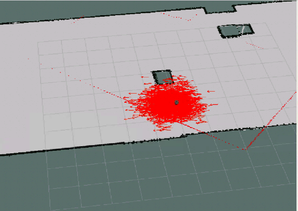 <br>
        <em> Generated Particles</em>

        </p>
        </p>
        
     - We use Rviz **2D Pose Estimate** button to send the navigation system an initial pose of the robot. After that, the amcl node will create large number of guesses(estimations where the robot position and orientation is w.r.t the environment) as you can see in the previous figure. The last thing is to start moving the robot around the environment by using **turtlebot3_teleop** package, until we see the guesses started to decrease and be concentrated . <br><br>  
        <p align="center">
        <p align = "center">
        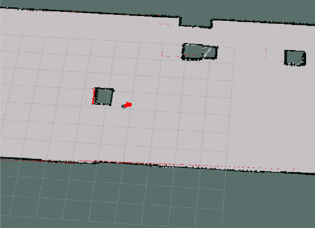 
           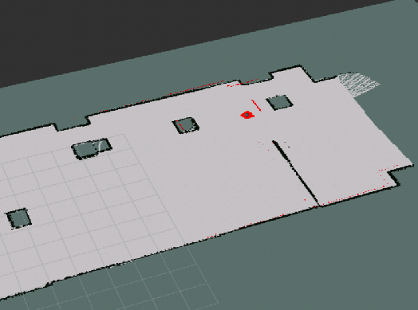 <br>
        <em> Generated Particles</em>

        </p>
        </p>
        As you can see in the above figure. When we move the robot, the guesses are getting more concentrated because of the wrong guesses are getting excluded by amcl. 
        
- To see our implementation for Localization, In the [launch folder](https://github.com/MahBadran93/ROS_Project/tree/main/catkin_ws%20/src/task_navigation/launch), we created a launch file called [start_localization](https://github.com/MahBadran93/ROS_Project/blob/main/catkin_ws%20/src/task_navigation/launch/start_localization.launch)  that will launch the **amcl** node. <br>
      
``` 
Task 3: Path Planning
```
<br> 

- After creating a map, localize the robot, we need to plan a path, trajectory for the robot to follow to reach a specific goal while avoiding obstacles along the way. To achieve this, we need to use **move_base** package which provides **move_base** node. This package is the base of the navigation task where it connects all the navigation components. See the figure below: 
  <p align="center">
  <p align = "center">
     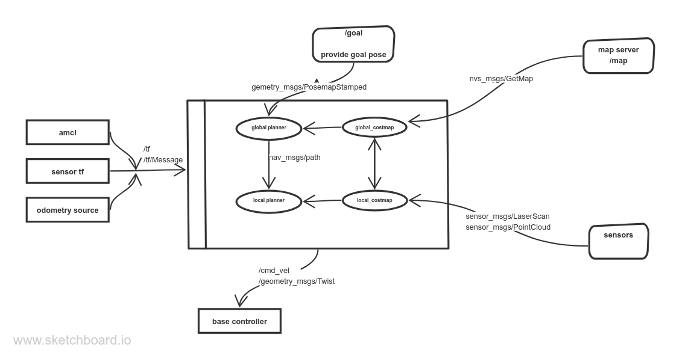 <br>
     <em>Navigation Task</em>
  </p>
  </p>
  
 - The figure shows how the **move_base** node interact with other system components. The node implements **SimpleActionServer** from **actionlib** package with message of type **geometry_msgs/PoseStamped**. Tha Action server provides **/goal** topic that will provide the **move_base** node with goal position. See table below to see description of some topics move_base node subscribe to and publishes. <br><br>

  
     Topics | Message |Description  
    ------------ | ------------ | -------------
    **move_base/goal** (``` subscribed```)|  ```move_base_msgs/MoveBaseActionGoal ``` |  Provide goal position using **SimpleActionServer** which will allow us to track the current goal position status. 
    **move_base_simple/goal** (``` subscribed```) |   ``` geometry_msgs/PoseStamped```  | Provide goal position to **/move_base** node directly without using **SimpleActionServer**.
    **/cmd_vel** (```published```) | ``` geometry_msgs/Twist```  |  Publish velocity information to the robot (base controller to make transformation). 
    <br> 
- **SimpleActionServer** provides topics like goal(**move_base_simple/goal**), Feedback (**/move_base/feedback**), Result(**/move_base/result**). 
    - **FeedBack**: Keeps updating the server about the current information of the robot along the path (current position, laser information).For example, if we create a goal and the robot start to move toward the goal. If we display the message from the FeedBack topic we will see real time updated information in the terminal. Execute this command. <br> 
      ```rostopic echo move_base/feedback```
    - **Result**: It is sent only once, a final pose of the robot is sent by the server to the move_base node When the robot reaches the goal.
       
   
- As you can see in the Navigation Task Figure above, there are parameters required to be loaded to the **/move_base** node: 
   - **Global Planner:** The new goal, when received by move_base node, will be sent to the Global Planner. It will be responsible for building a safe plan for the robot to avoid collisions, obstacles along the way to the goal. It is called global because it starts planing the path from the beginning for the whole map and it doesn't depend on the current laser information provided by the robot. <br> 
   - **Local Planner:** The local planner uses only the information currently provided by the robot sensor readings and plans a path within a small area surrounding the robot position. When the next set of information come in it plans a new piece of the path. 
   - **Costmap paremeters (local & global):** the costmap parameters are responsible for storing the information related to obstacles in the environment(map). The global costmap is a static map used to store information about the whole map to be used for global planning where local costmap is used to store local information (the small area surrounding the robot position) to be used for local planning. 
     <p align="center">
    <p align = "center">
       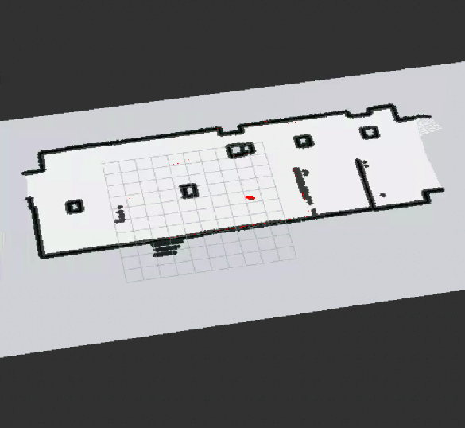 
       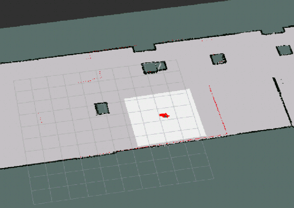 <br>
       <em>Global Costmap - Local Costmap</em>
  </p>
  </p>
  
 - To implement path planning with obstacle avoidance, we create a launch file where it includes the map_server package to get the map data, amcl package to localize the robot , and move_base package with its parameter configuration. As explained, move base node requires some parameters to be loaded. To configure and add move base node, we execute the following commands:  
   -  To launch the node:<br>
   ```  <node pkg="move_base" type="move_base" respawn="false" name="move_base" output="screen">" ```
   - Load the required files (local & global costmaps | local & global planners). All the required parameters are included in these yaml files: 
     ``` 
     <!-- rosparam is used to load parameters from yaml file-->
          <rosparam file="$(find t3_navigation)/param/costmap_common_params_$(arg model).yaml" command="load" ns="global_costmap" />
          <rosparam file="$(find t3_navigation)/param/costmap_common_params_$(arg model).yaml" command="load" ns="local_costmap" />
          <rosparam file="$(find t3_navigation)/param/local_costmap_params.yaml" command="load" />
          <rosparam file="$(find t3_navigation)/param/global_costmap_params.yaml" command="load" />
          <rosparam file="$(find t3_navigation)/param/move_base_params.yaml" command="load" />
          <rosparam file="$(find t3_navigation)/param/dwa_local_planner_params.yaml" command="load" />
       ```
        
- To create a goal, we can use Rviz. <br> 
   - Launch move_base node. The map should be created and the robot localized. (Turtlebot3)  
   - Run Rviz and add add all necessary displays to visualize the navigation process. 
   - To visualize the **local costmap**, **global costmap**, we add two **Map** display elements and attach them to **/move_base/local_costmap/costmap** and      **/move_base/global_costmap/costmap**  topics respectively. 
   - To visualize the **local plan**, **global plan**, we add two **Path** display elements and attach them to **/move_base/DWAPlannerROS/local_plan** and **/move_base/NavfnROS/plan** topics respectively.  
   - In Rviz, we choose **2D Pose Estimate** button to initialize the robot pose. Then we choose the **2D Nav Goal** button and click on the position where we want our turtlebot3 robot to move (goal). 
   - After creating a goal, a goal message (**gemetry_msgs/PoseStamped**) will be published to **/move_base/goal** topic. 
   - The goal message we published to **/move_base/goal** topic will be received by **SimpleActionServer** which is implemented in the move-base node. So, the      goal information will be received by the move_base node with goal topic provided by **SimpleActionServer** with message type **move_base_msgs/MoveBaseActionGoal** 
   - We can run this command to see what has been published to goal topic: <br> 
     ```rostopic echo /move-base/goal```
     <p align="center">
        <p align = "center">
           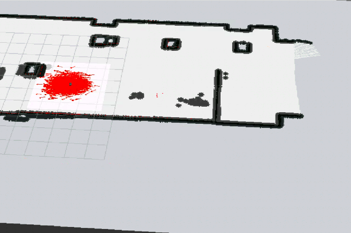 <br>
           <em>Initialize Robot Pose Using 2D Pose Estimate </em>
        </p>
      </p>
       <p align="center">
        <p align = "center">
           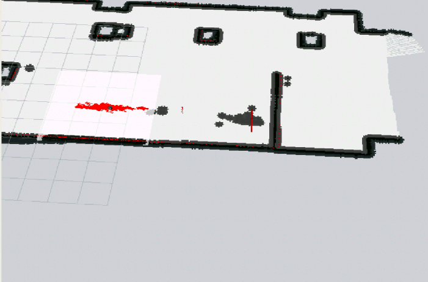 <br>
          <em>Set A Goal Using 2D Nav Goal And Start Moving Toward The Goal </em>
        </p>
      </p>
     
- We can create a goal by directly publishing to the goal topic. By executing this command: 
   -  ```rostopic pub /move_base/goal/ move_base_msgs/MoveBaseActionGoal```
   
- Another way we can create our goal is by creating an action client program(node) that send a goal to move_base. 
   - Initialize the node and create Publisher to publish the goal to **move_base** node. 
      ```
        rospy.init_node("GoalSender")
        pub = rospy.Publisher("move_base/goal", MoveBaseActionGoal)
        ```
          
    - Import all the move base package messages. Execute the following: <br> 
      ```from move_base_msgs.msg import ``` 
      
    - Create a function to send the goals. Inside the function we initialize a goal object from **MoveBaseActionGoal** and then we configure the goal parameters (position). Finally, we call the function to publish the goal. See below: 
      ``` 
          def GoalSender(publisher):
            goal = MoveBaseActionGoal()
            goal.goal.target_pose.header.frame_id = "map"
            goal.goal.target_pose.pose.orientation.w = 1.0
            goal.goal.target_pose.pose.position.x = 0
            goal.goal.target_pose.pose.position.y = -5
            publisher.publish(goal)
          GoalSender(pub)
        ``` 

      The **MoveBaseActionGoal** has a **goal** parameter of type **MoveBaseGoal.msg** which has the **target_pose** parameter of type **geometry_msgs/PoseStamped.msg** that will allow us to create a goal.
      
- To send goals using **SimpleActionServer**. 
   - We create a node and import the necessary packages like actionlib. 
      ``` 
          import actionlib
          from move_base_msgs.msg import MoveBaseAction, MoveBaseGoal
       ```   
   - Initialize an action server. So we create a move_base action client (**SimpleActionClient**). <br> 
      ```
      client = actionlib.SimpleActionClient('move_base',MoveBaseAction) 
      # this command to wait for the server to start listening for goals.
      client.wait_for_server()
      ```
   - Create a goal to send to the server. <br> 
      ```
          # Create a goal with the MoveBaseGoal directly
          goal = MoveBaseGoal()

          # Configure the parameters 
          goal.target_pose.header.frame_id = "map"

          goal.target_pose.header.stamp = rospy.Time.now()

          # Translate 0.8 meters along the x axis w.r.t. map reference frame 
          goal.target_pose.pose.position.x = 0.8

          # No rotation of the mobile base frame w.r.t. map reference frame
          goal.target_pose.pose.orientation.w = 1.0
        ```
      
   - Send the goal to the action server we created.  
     ```
        # Sends the goal to our action server.
        client.send_goal(goal)
        # Waits for the server till the end of the process.
        wait = client.wait_for_result()
       ```
  
   

- Now Turtlebot3 is able to navigate through the environment and follow a safe path without any obstacle collisions.<br><br>
  See the link below to see how the robot is moving toward a goal. <br><br>
  <p align="center">
  https://www.loom.com/share/62228958230144acb1ecae976b3dfa28
  </p>
  
- To see our implementation, we created a launch file called [start_navigation](https://github.com/MahBadran93/ROS_Project/blob/main/catkin_ws%20/src/task_navigation/launch/start_navigation.launch) in the [launch](https://github.com/MahBadran93/ROS_Project/tree/main/catkin_ws%20/src/task_navigation/launch) folder of the [task_navigation](https://github.com/MahBadran93/ROS_Project/tree/main/catkin_ws%20/src/task_navigation) package  that will be responsible for launching **move_base** package. This launch file will also launch the **start_localization** file and will import the map files with the **move-base** required parameters. Those parameters are stored in [param](https://github.com/MahBadran93/ROS_Project/tree/main/catkin_ws%20/src/task_navigation/param) folder.<br> 
We also created a node called [sendGoal](https://github.com/MahBadran93/ROS_Project/blob/main/catkin_ws%20/src/task_navigation/src/sendGoal.py) in the [src](https://github.com/MahBadran93/ROS_Project/tree/main/catkin_ws%20/src/task_navigation/src) folder of the [task_navigation](https://github.com/MahBadran93/ROS_Project/tree/main/catkin_ws%20/src/task_navigation) package that will be responsible for making the robot navigate to a specific goal

``` 
Task 4 : Create WayPoints  
```
<br>
<h4 align="center"> <ins> WayPoints  </ins> </h4>

If we want the robot to pass through multiple waypoints(goals) before reaching its destination, we can use a package called **follow_waypoints** where it will be responsible for storing these waypoints. This package will publish the stored waypoints to **move_base** node as a sequence and then the robot will reach the goal by navigating through all the waypoints.

- To install this package, we need to clone its [GITHUB](https://github.com/danielsnider/follow_waypoints) repository into our catkin src folder : <br> 
   ```git clone https://github.com/danielsnider/follow_waypoints.git``` <br>
   After installing the package we need to be build our catkin_ws working space again, so we change the current directory to catkin_ws and then we execute: 
   ```catkin_make```
   ```source /devel/setup.bash``` <br> 
   Now, we have **follow_waypoints** package ready. 
- To start the waypoint server, we first start the navigation task process we implemented before: <br> 
  ```roslaunch <our navigation package> <our launch file.launch>```
- Now we launch **follow_waypoints**: <br> 
  ```roslaunch follow_waypoints follow_waypoints.launch```  <br> 
- The waypoint server listen to **initialpose** (**amcl** and **follow_waypoints** subscribe to this topic) that is used to initialize the robot with message type    ```geometry_msgs/PoseWithCovarianceStamped```. The server will store all the waypoints and then will provide it to **move_base** node to start navigating through all the specified waypoints. 
- After launching all the necessary packages, we can start creating waypoints using **Rviz** and we add **PoseArray** display element(see Figure below) and we add **waypoints** topic to this display. We run **Rviz** tool with already implemented configuration this time .<br> 
   ```rosrun rviz rviz -d `rospack find turtlebot3_navigation`/rviz/turtlebot3_nav.rviz```. <br> 
    <p align="center">
        <p align = "center">
           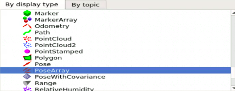 <br> 
           <em> PoseArray Display Element</em>
        </p>
      </p>
   
    
   - Use **2D pose Estimate** to create waypoints. 
       <br> 
       <p align="center">
        <p align = "center">
           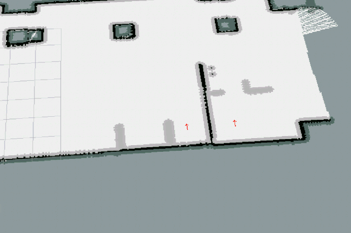
          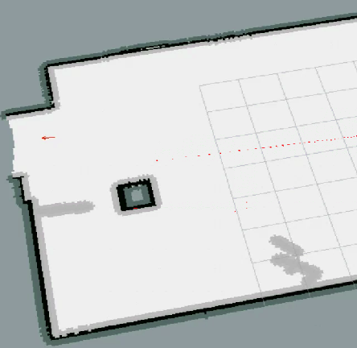<br>
           <br>
           <em> Setting the required waypoints(red arrows) for the robot to follow </em>
        </p>
      </p>

       
      
 - Now that we added our waypoints . We should start the **path_ready** topic (**follow_waypoints** subscribes to this topic to initaize the process to follow our waypoint), then it will start sending the waypoints we created to move_base node. This topic has message of type ```std_msgs/Empty```. To start the **path_ready topic**, we execute: <br> 
 ```rostopic pub /path_ready std_msgs/Empty -1```    
  After that, our Robot will start following the created waypoints. See the video bellow: <br><br>
  <p align="center">
  https://www.loom.com/share/150f75325a8c46789f8fdde45a46e514
  </p>
  
- If we want to create our own custom sequence of waypoints and implement the navigation through all the points autonomously, we've done the following: 
   - First, we set up waypoints locations. So, what we need is a coordinates of the waypoints with respect to map reference frame. To implement that, we create a list or a dictionary of our waypoint coordinates.
      ```
      def CustomWayPoints():
        # Create the dictionary 
        locations = dict()
        # add our waypoint names and values. 
        locations['waypoint1'] = Pose(Point(-9.583, 0.973, 0.000), Quaternion(0.000, 0.000, -0.717, 0.697))
        locations['waypoint2'] = Pose(Point(-11.841, 0.827, 0.000),Quaternion(0.000, 0.000, -0.707, 0.708))
        locations['waypoint3'] = Pose(Point(8.489, -3.809, 0.000), Quaternion(0.000, 0.000, -0.016, 1.000))
        return locations
      ```
      We can get these coordinates by using Rviz tool. Press the 2D Nav Goal button and click on the location of the waypoint we want. The coorinates will be displayed on the terminal. 
      
      
   - Subscribe to move_base action server. <br> 
      ```
      # subscribe to action server 
      client = actionlib.SimpleActionClient('move_base',MoveBaseAction)
      # this command to wait for the server to start listening for goals.
      client.wait_for_server()
  
      ```
   - Create a variable to hold the initial position of the robot w.r.t the map.<br> 
     ```
      # With msg type PoseWithCovarianceStamped. 
      initial_pose = PoseWithCovarianceStamped()
      ```  
     ```
      # This line of code is used when to get the initial position using RViz (The user needs to click on the map) 
      rospy.wait_for_message('initialpose', PoseWithCovarianceStamped)
     ```
   - Subscribe to **initialpose** topic with callback function called **update_initial_pose** to update the initial_pose variable with the current initial pose. 
        ```
        # Subscribe to initialpose topic 
        rospy.Subscriber('initialpose', PoseWithCovarianceStamped,update_initial_pose)
        # callback function to update the initial_pose vaule to the current initial pose. 
        def update_initial_pose(initial_pose):
          initial_pose = initial_pose
        ```  
   - Start the process of sending goals(waypoints) to move_base action server. We take a sequence of waypoint locations from the dictionary we created and then we iterate over the sequence to navigate through all waypoints. 
     ```
      # Iterate over all the waypoits, follow the path 
      for key, value in waypoints.items():
          goal = MoveBaseGoal()
          goal.target_pose.header.frame_id = "map"
          goal.target_pose.header.stamp = rospy.Time.now()

          goal.target_pose.pose.position.x = waypoints[key].position.x
          goal.target_pose.pose.position.y = waypoints[key].position.y
          goal.target_pose.pose.position.z = waypoints[key].position.z
          # Goal Orientation
          goal.target_pose.pose.orientation.x = waypoints[key].orientation.x
          goal.target_pose.pose.orientation.y = waypoints[key].orientation.y
          goal.target_pose.pose.orientation.w = waypoints[key].orientation.z
          goal.target_pose.pose.orientation.z = waypoints[key].orientation.w

          client.send_goal(goal)
          wait = client.wait_for_result()        
      rospy.loginfo('The waypoints path is complete')
      
        ```  
       
       See the video below to follow the process: <br><br>
         <p align="center">
          https://www.loom.com/share/c9699d2f21214a4485b9492f9f72eb3f
         </p>
  
   - In the [src](https://github.com/MahBadran93/ROS_Project/tree/main/catkin_ws%20/src/task_navigation/src) folder of our [task_navigation](https://github.com/MahBadran93/ROS_Project/tree/main/catkin_ws%20/src/task_navigation) package we created a node called [customWayPoints](https://github.com/MahBadran93/ROS_Project/blob/main/catkin_ws%20/src/task_navigation/src/customWayPoints.py) where it will be responsible for making the robot navigate through multiple waypoints.

  

## Conclusion
The simulation was run on Gazebo in 'The Construct'. The project is divided into four tasks which are
Robot Control, Mapping and Localization, Path Planning (Obstacle Avoidance)
and Way Point Navigation. The three most important and useful packages are
gmapping, amcl and move_base. We tested Navigation tutorials on multiple
Maps provided by 'The Construct' in multiple courses. The Construct courses
were really helpful and guiding in understanding the problem and implementing
the solution. With the evidence of working simulations and visualizations, we applied our knowledge obtained during the course and what we have planned before on the  simulated map of Costa Coee at Barcelona provided in the project description document.We were able to make the Robot navigate in the environment, use multiple waypoints before reaching a specific goal. We are open to any new ideas
and we intend to learn, relish making mistakes and gain expertise in Robotics.
We are convinced that ROS is a very powerful tool in robotics however it is
not easy to gain expertise. It is a universe of information in itself. We felt a lot
of pressure for our tight schedules and the constraint of timing was felt gravely.
We tried our best to practice and learn and what we have is a birds eye view of
ROS. We recommend that the course of ROS be taught in two semesters keeping
the intensity of work less. The Construct is a wonderful platform and it makes
learning of ROS quite smooth and ecient. However, it has some fundamental
issues that make it less compatible. The Construct has stability issues. It is slow
and sometimes it crashes. It is unstable, not trust-able regarding the privilege
of saving progress. The Construct consumes a lot of Data and it is very dicult
to use it on limited internet packages. We recommend them that there is a lot
of room for improvement in computation and stability of website.
Due to COVID-19, we are working from home and do not have any access
to real robots and we understand that. But, It is certain that we might not
be able to gain expertise in working with real robots and we surely miss that
opportunity.

## References
  - [WIKI ROS](http://wiki.ros.org/)
  - [The Construct Platform](http://theconstructsim.com)
  - ROS By Example, A Do-It-Yourself Guide to the Robot Operating System, VOLUME 1, A PI ROBOT PRODUCTION, R. PATRICK GOEBEL. Section 8.5.3 [Book](https://drive.google.com/file/d/1aZ8jmMl6UAiN0Qi_xSbD2nOgiCnx72y3/view)

