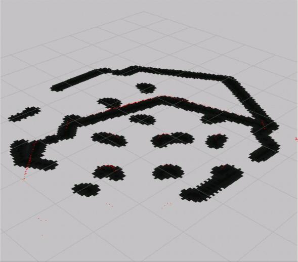
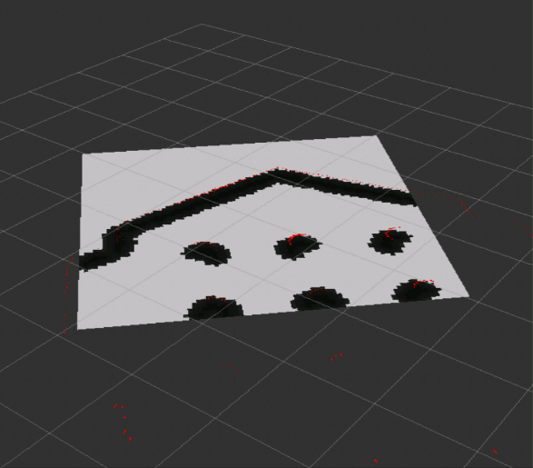

<h1 align="center"> Robotics Project </h1> <br>
<h3 align="center"> Planning, Developing, Learning ROS </h3> <br>
<p align="center">
University Of Burgundy (VIBOT)
  <p align="center">
      
  </p>
</p>

<h3 align="center">                       
Supervisors: <br>  
 Ralph SEULIN
</h3>
<h4 align="center">                       
Students: <br>  
 Mahmoud Badran,  Arsalan Khawaja
</h4>
<p align="center">
  <p align = "center">
     
     
    
  </p>
</p>

[](https://shields.io/)
[](https://shields.io/)
[](http://wiki.ros.org/kinetic/Installation)
[](https://www.theconstructsim.com/)


## Project Management (Technical Report)

- [Introduction](#introduction)
- [Project Tasks](#Project-Tasks)
- [Analysis OF Studied Techniques](#Analysis-OF-Studied-Techniques)
- [ROS Packages](#ROS-Packages)
- [Work Plan](#Work-Plan)
- [Conclusion](#Conclusion)

<!-- END doctoc generated TOC please keep comment here to allow auto update -->

## Introduction
Robotics Operating System (ROS), is a middleware, low level framework, to write robotic softwares. It can be cosidered as an API to make the process of developing a robotic related projects more flexible, and simplified. There will be no need for an extensive knowledge of the hardware in which it saves much effort and time in the development phase. It includes many libraries and tools which connects and control the robot manipulators, handle the communication between multiple devices in a a working space. <br>
ROS is supported by many operating systems like ubunto, windows. Ubunto is the more stable operating system working with ROS. However, for the development of this project we are using the construct web plaform, which is an online robotics working environmant. The platform uses ubunto as the main operating system with ROS kinetic and uses the **Gazebo** as real world simulator with many robot model simulations like turtlebot 3. The platform will enable us to learn some of ROS basic techniques to be able to apply Robot Control, Mapping, Robot Localization, Path planning and setting up some goals to navigate through the environment.  

## Project Tasks 
The project goal is to apply the learned **ROS** techniques and pakages to apply the navigation task on Turtlebot3:  
- Moveing the robot around the environment using **/cmd_vel** topic. <br>
- Construct a map of the whole environment. We need to fully occupy the whole environment, then we need to localize the Robot. <br>
- Path planning, we need to publish a goal to move base navigation system in which Turtlebot3 can reach
that goal without colliding with any obstacles. <br> 
- Create a waypoints that allows the Turtlebot3 to navigate within the environment. 

## Analysis OF Studied Techniques

Let's explain some important concepts that have been studied and will be important in developing the project : <br><br>
- **Nodes**: One of the most important concepts in ROS. We can describe nodes as a program (python, c++) to enable ROS to make communication tasks. A node can subscribe or publish to a topic, which will be explained. <br><br>
- **Topic**: The process of transmitting data between nodes. Some nodes are responsible for publishing some data to a specific topic where other nodes (subscribers) will be able to request these data ( messages ) from the topic.<br><br>
- **Messages** : Data structure which describes the data that ROS nodes publish or recieve. the nodes communicate, send messages, receive messages through topics.<br><br>
- **Services** : another way to transmit the data between nodes. it is a synchronous operation where the robot has to stop processing while waiting for a service response.<br><br>

<p align="center">
  <p align = "center">
     
  </p>
</p>

## ROS Packages


## Work Plan

```
Task 1: Robot Control
```
To control TurtleBot3, which is a mobile robot with small size and low price but still have the same quality that other mobile robots have. The first thing we need to know is the topics that make the Robot move in the environment. One important command we can use to know what are the topics that got published by the environment. <br> 
```rostopic list``` <br> 
By executing this command, we can see all the topics provide by the environment. One of the topics that should be provided to move the robot is **/cmd_vel**:   

- With this topic we can publish velocity information to the robot. if we want to know more information about this topic we can execute this command: <br> 
   - ```rostopic info /cmd_vel ``` <br> 
       After running the command we can see that this topic uses **Twist** type messages. So, this topic recieves data of type Twist (angular and linear         velocities ,(x,y,z)). To know more information about the message we execute this command: <br> 
       ```rosmsg show geometry_msgs/Twist``` <br> 
       See the Figure below : <br> 
       <p align="center">
          <p align = "center">
             
          </p>
        </p>
         
- TurtleBot3 revieves the velocity information by subscribing to this topic. It will be provided with translation and rotation information. 
- We can publish to this topic by running this command: 
  ```rostopic pub /cmd_vel  TAB TAB```
  And then in the terminal we can edit the values of the two vectors. 
- Otherwise, we can create a launch file to run a node responsible for publishing velocity information to the robot. see the code below: <br> 
   ```self.pubNode = rospy.Publisher('/cmd_vel', Twist, queue_size=1)``` <br> 
   ```self.msgTwistObj = Twist()``` <br> 
   ```self.msgTwistObj.linear.x = 0.2 ```<br> 
   ```self.pubNode.publish(self.msgTwistObj)``` <br> 
   Here, we create a vairable called **pubNode** that is responsible to publish Twist information to cmd_vel topic. And another variable called **laserMsg** that holds Twist values. AS you can see in the last command , we added 0.2 value the x linear position of the robot.The last command, we used publish function to publish the new updated message values. <br> 
- Another topic we use is **/scan** topic, we use this topic to get the laser information, readings from the robot. For example, the distance between the robot nad a wall in the environment. The message used is of type **LaserScan**. See the commands below:<br> 
```self.subNode = rospy.Subscriber('/scan', LaserScan, self.callback)```<br> 
```self.laserMsg = LaserScan()```<br> 
    In our node, we create another variable called **subNode** to subsicribe to **scan** topic. And another variable called **laserMsg** which holds a laser information and readings.  The **callback** parameter in the Subscriber function is a function that have the updated laser information. see command bellow:<br> 
    ```def callback(self, msg):```<br>
        ```self.laserMsg = msg```<br>   
    ```self.laserMsg.ranges```   <br> 
   So, whenever the robot moves, the variable **laserMasg** will be updated. One of the useful information we can obtain from **laserMsg** is the **ranges** parameter. we use **ranges** parameter to know the distance between the robot and an object in the environment. <br> 
   See the Figure below. It shows different frames of the robot after launching the node which is responsible for moving the robot. **Explain More About Ranges**

<p align="center">
  <p align = "center">
     
    
    
    
  </p>
</p>
<br><br>

``` 
Task 2: Mapping & localization 
```
<h4 align="center"> <ins> Mapping </ins> </h4>

To start the autonomus navigation process, the robot must have a map of the environment to be able to recognize objects, walls where it will allow the robot to plann trajectories through environment. <br> 
In order to construct a map : <br> <br>

- First of all, before the start of the mapping process, it is necesseary to start and launch our turtlebot3. It is done using the **turtlebot3_bringup** package and starting **turtlebot3_remote.launch**. file. <br> 
 ```<include file="$(find turtlebot3_bringup)/launch/turtlebot3_remote.launch" />``` <br> 
 This code is included inside the luanch file in our current package.

- We need to use **gmapping** package and run **slam_gmapping** node. 
    This node is implementing the gmapping **SLAM** algorithm. It creates a 2D map of the environment using the data the Robot is providing during movement like       laser data, in which it will be transformed to an Occumaoncy Grid Map (OGM) data format (**nav_msgs/OccupancyGrid.msg**) where it represents a 2-D grid map and each cell of the grid represents the occupancy ( if the cell is completely occupied or completely free). <br>
    Start the mapping process by executing this command: <br>
    ``` rosrun gmapping slam_gmapping ``` <br><br>
- In the mapping process, an important tool is used called **RViz**. It will help us in visulising th map creation process, it will allow us to see what the robot is covoring from the environment. <br>   
To launch Rviz. Execute this command: ``` rosrun rviz rviz ```
    <p align="center">
    <p align = "center">
       
    </p>
    </p>
- You can see in the figure above **Rviz**. In the left, we can see the displays which can be addded by us. we are interested in three displays which are:
    - **Map**: visulize the map. Topic is **/map** where it has message of type Occupancy Grid Map **OGM**, ```nav_msgs/OccupancyGrid.msg ```  <br> 
    - **LaserScreen**:  visualze what the Lazer on the robot is detecting. Topic is **/scan**<br>
    - **RobotModel**:  localize the Robot on the map.<br><br>
- After launnching **slam_gmapping** and **RViz**, we can start moving the robot by executing Kerbord control command:<br> 
  ```roslaunch turtlebot_teleop keyboard_teleop.launch ```.<br> After moving the robot around all the places needed we should see the map fully occupied in **Rvis**<br>
    <p align="center">
    <p align = "center">
       
    </p>
    </p> 
- The map can be saved using **map_server** package, it includes **map_savor** node  which will allow us to access the map data. 
    Execute this command : <br> 
    - ``` rosrun map_server map_savor -f <file_name> ```
 After executing it will generate two files: <br><br>
       - **file_name.pgm:** PGM stands for Prtable Gray Map where it contains the Occupancy Grid Map(OGM) data. If we download the file and open it, it will look like this: 
      <p align="center">
      <p align = "center">
          <br>
        <em>Each cell ranges from 0 to 100 integer value where 0 means completely free and not occupied, 100 is completely occupied</em>
      </p>
      </p>
      
       - **file_name.yaml:** This file contains the meta data of the generated map which contains these parametrs, image,resoulution, origin, occupied_thresh, free_thresh,negate. 
 
--- 
 
<h4 align="center">  <ins> Localization </ins> </h4>

After creating the map, the next step is to locate the robot in the environment (created map). We can define localization as the process of finding the location of the robot in respect with the environment. For now, we have the map of the environment created, and we have sensors located on the robot which will observe the environment then we do localization to estimate the coordinates and angles of where the robot is located in the environment. 

- To apply localization, we use **amcl** package. It is a localization system that implements Kullback-Leibler algorithm which uses an adaptive practicale filters to track the position of the robot in repect with the environment.  

    Subscribed Topics (message type) | published Topics (message type) 
    ------------ | -------------
    **map** (``` nav_msgs/OccupancyGrid```) | **amcl_pose** (```geometry_msgs/PoseWithCovarianceStamped```)
    **scan** (```sensor_msgs/LaserScan```) | **particlecloud** (```geometry_msgs/PoseArray```)
    **tf** (```tf/tfMessage```) | **tf** (```tf/tfMessage```)

- **map:** amcl subscribe to map topic to get the map data (OGM), to used it for localization. 
- **scan:** To have the updated scan readings. 
- **tf:** Transform topic which is necessery to provide the relationship between different reference frames. For example, translate from the base_laser coordinate frame to base_link coordinate frame. 
- **amcl_pose:** amcl node publishes the position of the robot in the environment to the amcl_pose topic.
- **particlecloud:** amcl publishes the particle cloud of arrows created by the system to measure the uncertainty of the robot current position. see the figure below (red arrows displayed using Rviz,add **PoseArray** display which subscribe to **PointCloud** topic).
 To launch amcl and call the generated map file, we create a launch file which includes: <br> 
 
   
    - Lunch TurtleBot3 applications: <br> ```<include file="$(find turtlebot3_bringup)/launch/turtlebot3_remote.launch" />```
    - Call our generated map file:<br> ```<arg name="map_file" default="$(find pkg_name)/maps/map.yaml"/>```
    - run map server node with our generated map:<br> ```<node name="map_server" pkg="map_server" type="map_server" args="$(arg map_file)" />```
    - launch amcl node:<br> ```<node pkg="amcl" type="amcl" name="amcl">```
    
  <p align="center">
  <p align = "center">
      <br>
  </p>
  </p>
      
``` 
Task 3: Path Planning
```
- After creating a map, localize the robot, we need to plan a path, trajectory for the robot to follow to reach a specific goal while avoiding obstacles along the way. To achieve this, we need to use **move_base** node which will be resposible for managing this task. See the figure below: 
  <p align="center">
  <p align = "center">
      <br>
     <em>Navigation Task</em>
  </p>
  </p>
  
 - The figure shows how the **move_base** node interact with other system compnents. The node implements **SimpleActionServer** with message of type **gemetry_msgs/PosemapStamped**. Tha Action server provides **/goal** topic that will provide the **move_base** node with goal position. 
 

     Topics | Message |Description  
    ------------ | ------------ | -------------
    **/goal** (``` subscribed```)| ``` gemetry_msgs/PosemapStamped``` | Provide goal position to **/move_base**. 
    **/cmd_vel** (```published```) | ``` geometry_msgs/Twist```  |  publish velocity information to the robot. 


- As you can see in the Navigation Task Figure above, there are parameters required to be loaded to the **/move_base** node: 
   - **Costmap paremeters (local & global):** the costmap parameters are responsible for storing the information related to obstacles in the environment(map). The global cost map is used to store information about the whole map (global planning) where local costmap is used to store local information which means the small area surrounding the robot position(local planning). 
     <p align="center">
    <p align = "center">
        
        <br>
       <em>Global Planning - Local Planning</em>
  </p>
  </p>

- To implement path planning we create a launch file where it includes the map server(config. explained), amcl(config. explained) , and move base packages with its parameter dependences. As explained, move base node requires some parameters to be loaded. To configure and add move base node, see the following code:  
   -  To launch the node:<br>
   ```  <node pkg="move_base" type="move_base" respawn="false" name="move_base" output="screen">" ```
   - Load the required parameters (local & global costmaps): 
   ```  <!-- rosparam is used to load parameters from yaml file-->
        <rosparam file="$(find t3_navigation)/param/costmap_common_params_$(arg model).yaml" command="load" ns="global_costmap" />
        <rosparam file="$(find t3_navigation)/param/costmap_common_params_$(arg model).yaml" command="load" ns="local_costmap" />
        <rosparam file="$(find t3_navigation)/param/local_costmap_params.yaml" command="load" />
        <rosparam file="$(find t3_navigation)/param/global_costmap_params.yaml" command="load" />
        <rosparam file="$(find t3_navigation)/param/move_base_params.yaml" command="load" />
        <rosparam file="$(find t3_navigation)/param/dwa_local_planner_params.yaml" command="load" />
        ```
   
 - After creating the launch file, we need to visulize the path planning process, we run Rviz 
  
  

## Conclusion

## Sponsors [](#sponsors)

Support this project by becoming a sponsor. Your logo will show up here with a link to your website. [[Become a sponsor](https://opencollective.com/git-point#sponsor)]

<a href="https://opencollective.com/git-point/sponsor/0/website" target="_blank"></a>
<a href="https://opencollective.com/git-point/sponsor/1/website" target="_blank"></a>
<a href="https://opencollective.com/git-point/sponsor/2/website" target="_blank"></a>
<a href="https://opencollective.com/git-point/sponsor/3/website" target="_blank"></a>
<a href="https://opencollective.com/git-point/sponsor/4/website" target="_blank"></a>
<a href="https://opencollective.com/git-point/sponsor/5/website" target="_blank"></a>
<a href="https://opencollective.com/git-point/sponsor/6/website" target="_blank"></a>
<a href="https://opencollective.com/git-point/sponsor/7/website" target="_blank"></a>
<a href="https://opencollective.com/git-point/sponsor/8/website" target="_blank"></a>
<a href="https://opencollective.com/git-point/sponsor/9/website" target="_blank"></a>

## Acknowledgments

Thanks to [JetBrains](https://www.jetbrains.com) for supporting us with a [free Open Source License](https://www.jetbrains.com/buy/opensource).
